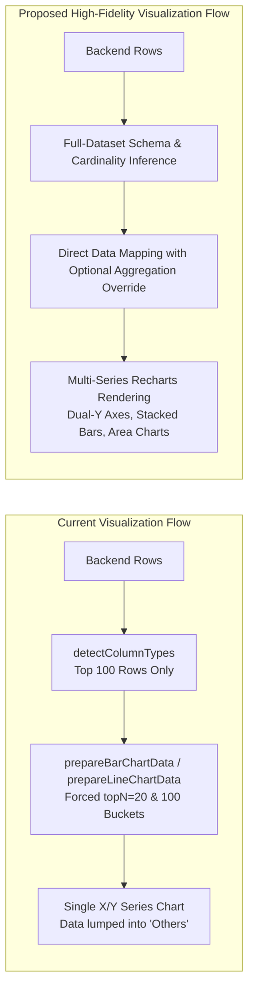

# Graphical Representation & Analytical Pipeline Overhaul

This implementation plan addresses the critical bottlenecks making graphical query building and data visualization unproductive in **DoubleDecker**. Currently, the platform suffers from a rigid, linear query execution pipeline, disconnected modal dialogs without intermediate visual feedback, forced client-side chart re-aggregation that causes data loss (the "Others" trap), and single-series chart limitations.

This overhaul transforms DoubleDecker into an interactive, multi-stage data workbench with visual data flow lineage, flexible query step chaining, raw-data chart fidelity, and multi-series visualization capabilities.

---

## User Review Required

> [!IMPORTANT]
> **Flexible Query Pipeline Migration**: Moving from a fixed sequence (`Filter -> Transform -> GroupBy -> Sort`) to an ordered array of step objects (`PipelineStep[]`) will change the payload structure sent to `queryService.executeQuery()`. We must ensure the backend API can accept sequential, ordered operation arrays without enforcing a strict type hierarchy.

> [!WARNING]
> **Chart Re-Aggregation Override**: Removing automatic client-side top-$N$ slicing and time bucketing in `prepareBarChartData` and `prepareLineChartData` means visualizations will render the exact dataset returned by the backend. For very large datasets ($>5,000$ rows), we will introduce a UI toggle ("Enable Client Slicing") rather than silently mutating data.

---

## Open Questions

> [!IMPORTANT]
> **Backend Pipeline Execution Order**: Does the backend endpoint currently support arbitrary operation chaining (e.g., `Filter -> GroupBy -> Filter -> Transform`), or will we need to update `operation_alias.md` and the backend query parser to support multi-stage pipeline execution?

> [!TIP]
> **Canvas UX vs. Step-by-Step Workbench**: Should we replace `OperationsSidebar.tsx` with a vertical, reorderable step card workbench (similar to Jupyter/Retool steps), or a 2D node-based drag-and-drop canvas (using React Flow)? (Recommended: **Vertical Reorderable Step Workbench** for cleaner CSV tabular data lineage).

---

## Current Architecture vs. Proposed Architecture

### 1. Query Execution Pipeline Flow

```mermaid
graph TD
    subgraph Current ["Current Rigid Pipeline (Linear & Unordered in UI)"]
        A1[Upload CSV] --> B1[Filter Modal]
        B1 --> C1[Transform Modal]
        C1 --> D1[GroupBy Modal]
        D1 --> E1[Sort / Limit Modal]
        E1 -->|Fixed Hardcoded Order| F1[Backend Execution]
    end

    subgraph Proposed ["Proposed Interactive Workbench (Ordered & Chained)"]
        A2[Upload CSV] --> B2[Step 1: Any Operation]
        B2 -->|Preview Row Count & Schema| C2[Step 2: Any Operation e.g. Post-Group Filter]
        C2 -->|Preview Row Count & Schema| D2[Step 3: Multi-Column Transform]
        D2 -->|Reorderable Step Chain| E2[Backend Execution]
    end
```



### 2. Visualization Data Processing



---

## Proposed Changes

### Visual Query Builder & Pipeline Engine

#### [MODIFY] [QueryBuilder.tsx](file:///c:/Users/User/Documents/doubledecker-FE/src/pages/QueryBuilder.tsx)
- Refactor state from disconnected arrays (`filters`, `transforms`, `sorts`, `groupBy`) into a unified, ordered pipeline state: `const [pipeline, setPipeline] = useState<PipelineStep[]>([])`.
- Update `handleRunQuery` ([L388-480](file:///c:/Users/User/Documents/doubledecker-FE/src/pages/QueryBuilder.tsx#L388-L480)) to serialize operations in the exact user-defined step order rather than hardcoding step sequences.
- Implement step-by-step schema tracking so that adding a `GroupBy` step dynamically computes the output columns available to subsequent steps in the chain.

#### [MODIFY] [OperationsSidebar.tsx](file:///c:/Users/User/Documents/doubledecker-FE/src/components/QueryBuilder/OperationsSidebar.tsx)
- Replace static badge accordions with a **Vertical Reorderable Pipeline Workbench**.
- Allow users to drag-and-drop steps to reorder them (e.g., move a filter after a group-by).
- Add inline editing controls and step deletion directly within the sidebar cards to minimize modal disruption.

#### [NEW] [PipelineStepCard.tsx](file:///c:/Users/User/Documents/doubledecker-FE/src/components/QueryBuilder/PipelineStepCard.tsx)
- Create a dedicated component for representing an individual transformation step in the pipeline.
- Include visual indicators for input schema vs. output schema and summary statistics (e.g., *"Filtered out 142 rows"*, *"Grouped by 2 columns"*).

---

### Visualization & Charting Engine

#### [MODIFY] [dataAggregation.ts](file:///c:/Users/User/Documents/doubledecker-FE/src/utils/dataAggregation.ts)
- Update `detectColumnTypes` ([L229-298](file:///c:/Users/User/Documents/doubledecker-FE/src/utils/dataAggregation.ts#L229-L298)) to scan a larger, representative sample of rows (up to 1,000 rows or stratified sampling) and make type inference robust against currency symbols, commas, and percentage strings.
- Modify `aggregateByCategory` ([L21-81](file:///c:/Users/User/Documents/doubledecker-FE/src/utils/dataAggregation.ts#L21-L81)) and `aggregateByTime` ([L86-150](file:///c:/Users/User/Documents/doubledecker-FE/src/utils/dataAggregation.ts#L86-L150)) to accept an `enableClientAggregation` boolean flag. When disabled, bypass aggregation and return raw data points.

#### [MODIFY] [visualizationPreparers.ts](file:///c:/Users/User/Documents/doubledecker-FE/src/utils/visualizationPreparers.ts)
- Expand `PreparedChartData` and preparer functions (`prepareBarChartData`, `prepareLineChartData`) to support **multi-series data configurations** (e.g., `valueColumns: string[]` instead of a single `valueColumn`).
- Add data preparers for new visualization types: **Area Chart** and **Stacked Bar Chart**.

#### [MODIFY] [QueryResults.tsx](file:///c:/Users/User/Documents/doubledecker-FE/src/pages/QueryResults.tsx)
- Upgrade chart configuration controls ([L39-48](file:///c:/Users/User/Documents/doubledecker-FE/src/pages/QueryResults.tsx#L39-L48)) from single-select dropdowns to multi-select checkboxes for Y-axis metric columns.
- Add UI toggles for chart customization: *"Stack Series"*, *"Show Trendline"*, and *"Disable Client-Side Grouping"*.

#### [MODIFY] [BarChartViz.tsx](file:///c:/Users/User/Documents/doubledecker-FE/src/components/visualizations/BarChartViz.tsx) & [LineChartViz.tsx](file:///c:/Users/User/Documents/doubledecker-FE/src/components/visualizations/LineChartViz.tsx)
- Refactor Recharts `<BarChart>` and `<LineChart>` rendering loops to dynamically generate multiple `<Bar>` or `<Line>` components when multiple metrics are selected.
- Add support for brand-consistent color palettes across multiple series (using London Bus Red tones and complementary HSL accents).

---

## Verification Plan

### Automated Tests
- Run existing and new unit tests for data aggregation and visualization preparers:
  ```bash
  npm run test
  ```
- Add test suites in `src/test/` verifying that:
  1. `detectColumnTypes` correctly classifies numeric columns formatted with commas and currency.
  2. Multi-series preparers return correct data structures for multiple value columns.
  3. Ordered pipeline serialization preserves step order without hardcoded sorting.

### Manual Verification
1. **Pipeline Ordering Test**:
   - Launch local dev server (`npm run dev`).
   - Upload a sample CSV dataset (e.g., sales data).
   - Add a `GroupBy` step, then add a `Filter` step *after* the grouping. Verify that the sidebar reflects the sequential order and that execution succeeds.
2. **Multi-Series Charting Test**:
   - Navigate to query results with multiple numeric columns.
   - Select `Bar` or `Line` chart, select 2 or more metrics for the Y-axis.
   - Verify that Recharts displays multiple colored series with clear tooltips and legends.
3. **High-Fidelity Rendering Test**:
   - Verify that toggling off client-side aggregation displays all categories without collapsing data into an `"Others"` bar.
